# Personal Finance Tracker

A web-based Personal Finance Tracker application that allows users to track their income and expenses, categorize transactions, and manage financial data. The app provides an interactive dashboard for viewing overall statistics and managing categories and transactions.

## Table of Contents
- [Features](#features)
- [Technologies Used](#technologies-used)
- [Installation](#installation)
- [Usage](#usage)
- [Screenshots](#screenshots)

## Features
- **Dashboard:** Summary of financial data, including total income and expenses, recent transactions, and visual representations (pie and bar charts).
- **Transaction Management:** Add, edit, and view income and expense transactions.
- **Category Management:** Add, update, and delete income and expense categories.
- **Transaction Filtering:** Filter transactions by date, type, and category.
- **User Management:** Register and log in as a user to manage your finances.
- **Validation:** Server-side validation for transactions (e.g., amount should be positive, description cannot be empty).

## Technologies Used
- **Java:** Backend logic using Java and Spring Boot.
- **Spring Boot:** Framework for building the application.
- **Thymeleaf:** Server-side template engine for dynamic HTML pages.
- **MySQL:** Database for storing transaction, category, and user data.
- **Spring Data JPA:** For interacting with the MySQL database.
- **Spring Security:** For user authentication and login functionality.

## Installation

### Prerequisites
- Java 17 or later
- Maven
- MySQL

## Installation

### Configure the MySQL database:
1. Create a MySQL database for the project.
2. Name the MySQL as "finance"
3. Update the `application.properties` file with your MySQL username, password, and database URL. (username - root , password -)
4. Run the application using your IDE
   
### Access the application:
- Open your browser and go to [http://localhost:8080](http://localhost:8080/Finance/Login).

## Usage
- **Dashboard:** Shows a summary of total income, total expenses, and recent transactions.
- **Transaction Entry:** Add a new transaction by specifying the amount, date, type (income or expense), and category.
- **Transaction History:** View all transactions with options to filter by date, category, or type.
- **Category Management:** Add, edit, and delete categories for both income and expenses.
- **User Authentication:** Register as a new user or log in with existing credentials.
  
### ScreenShots

### Login
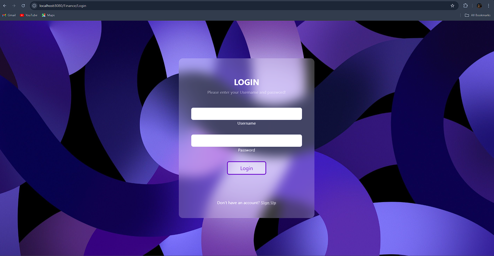

### Register 
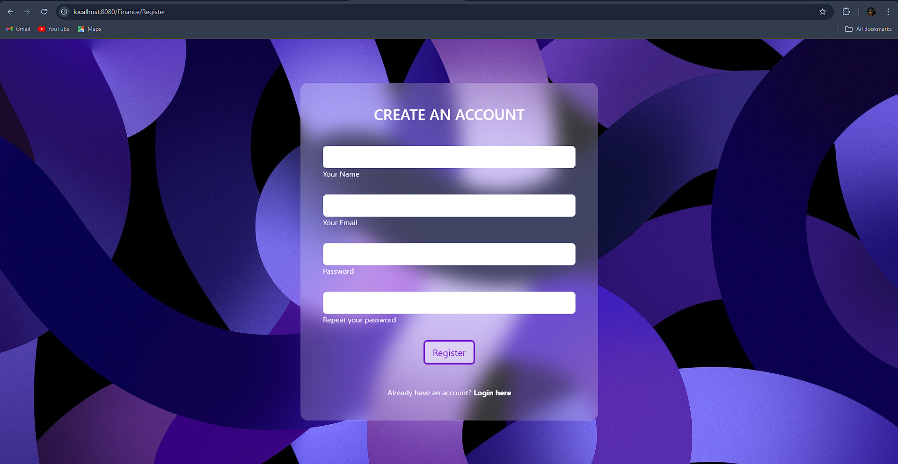

### Dashboard
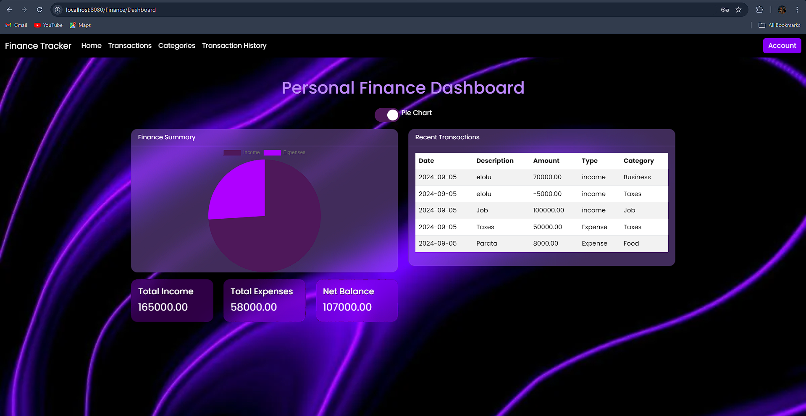
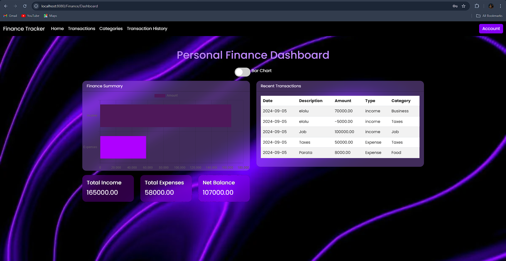

### Transaction Entry
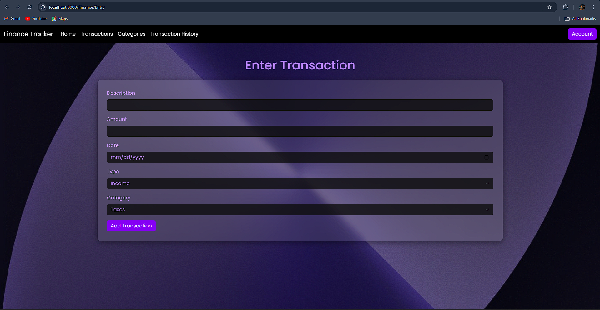

### Category manage
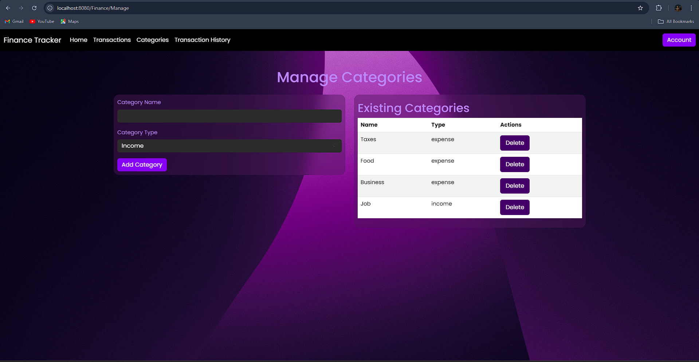

### Transaction history
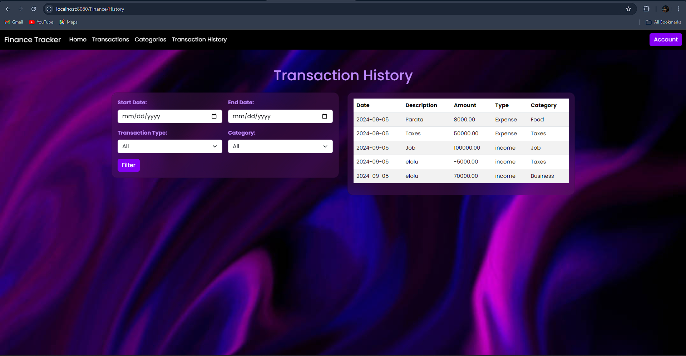

### Resized Models for mobile
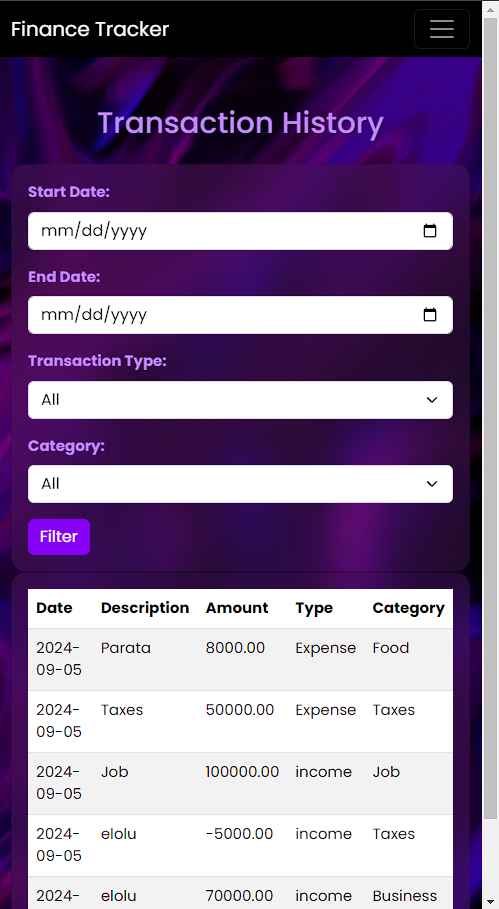
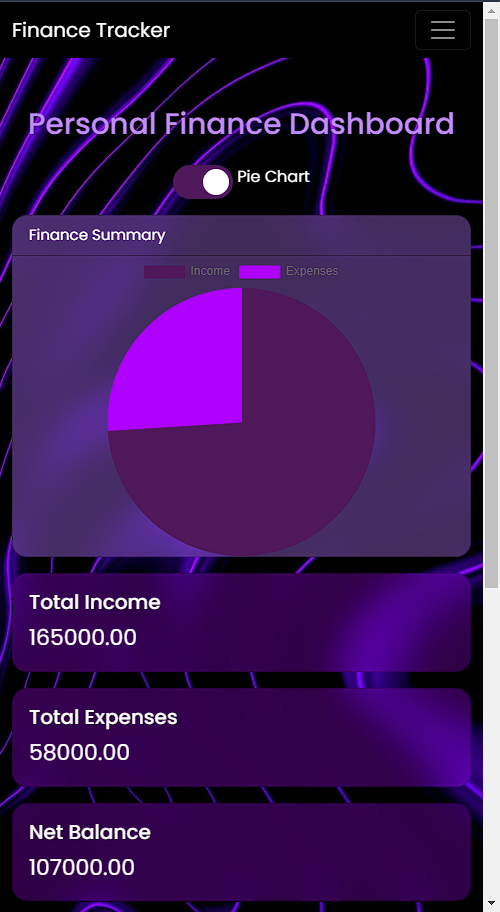
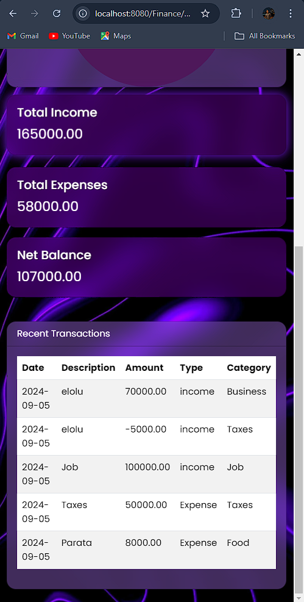
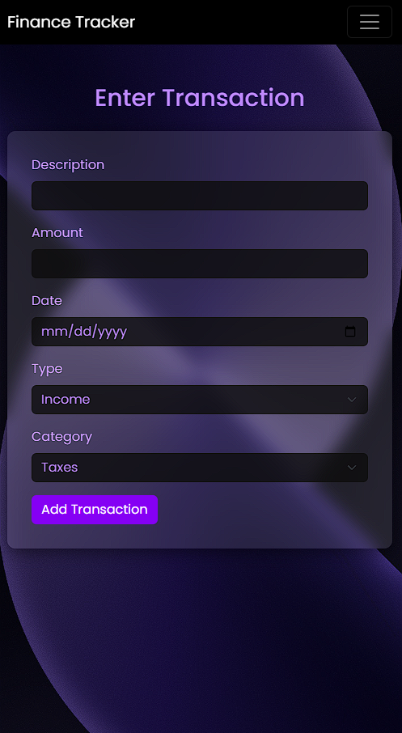
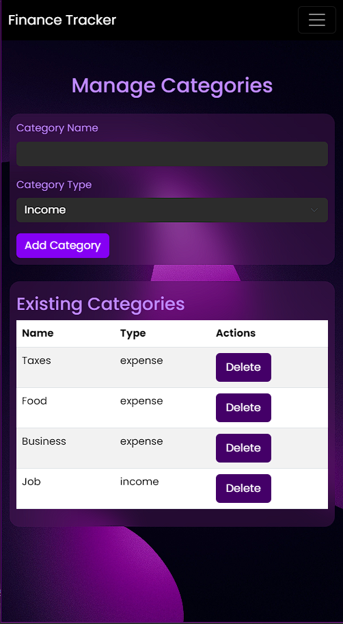

